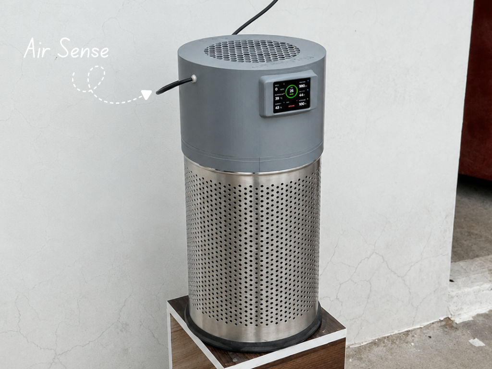
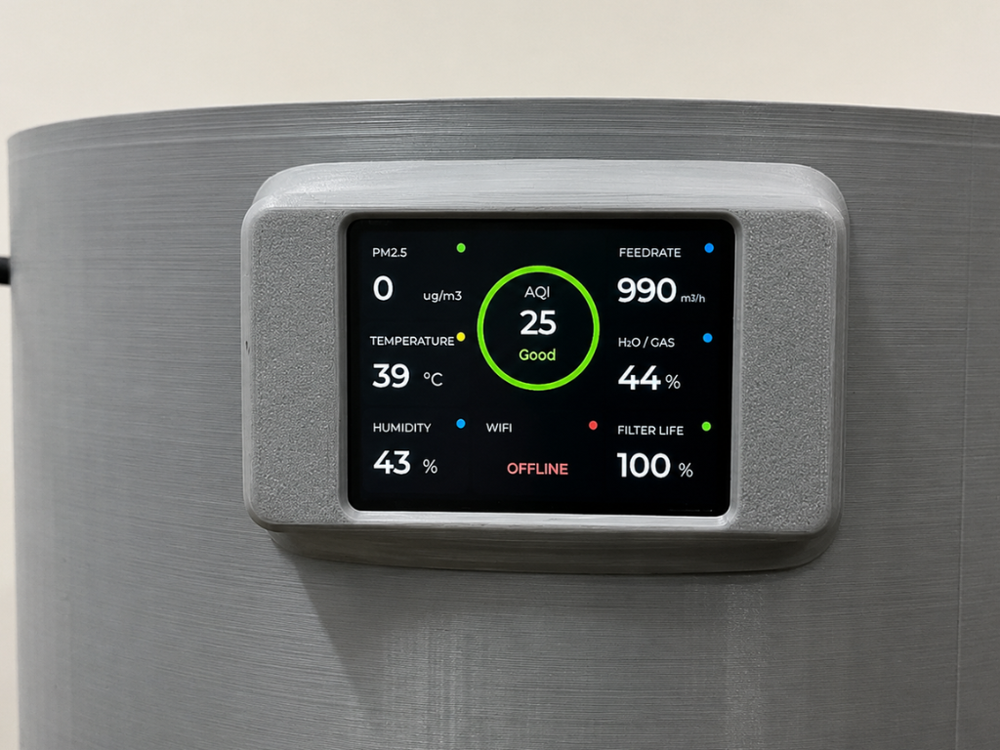
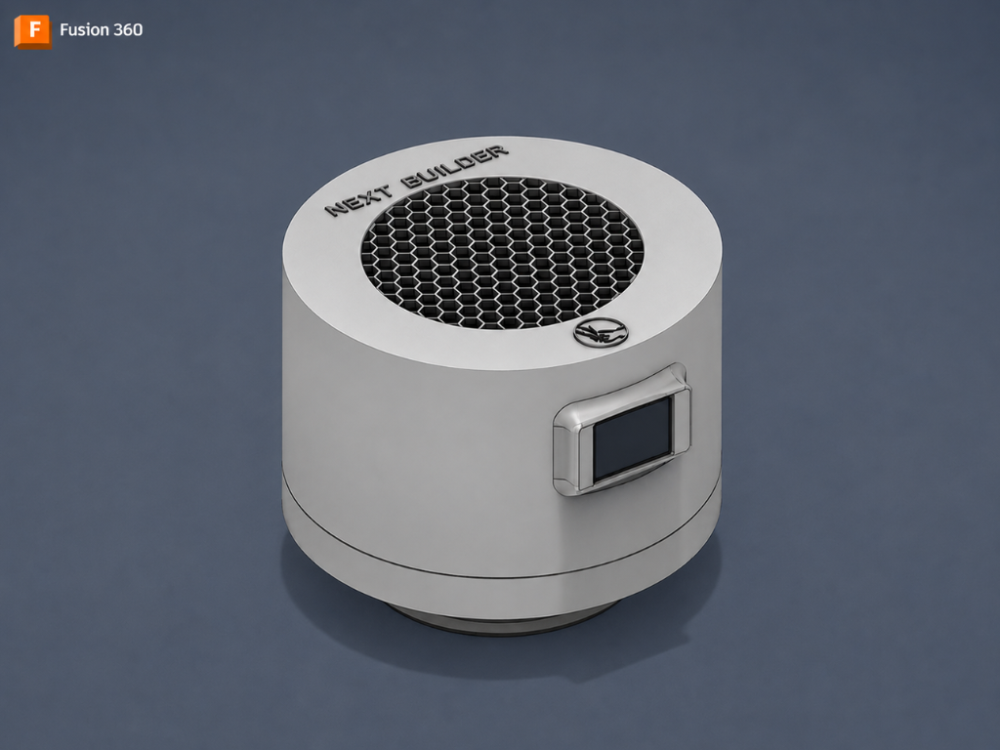
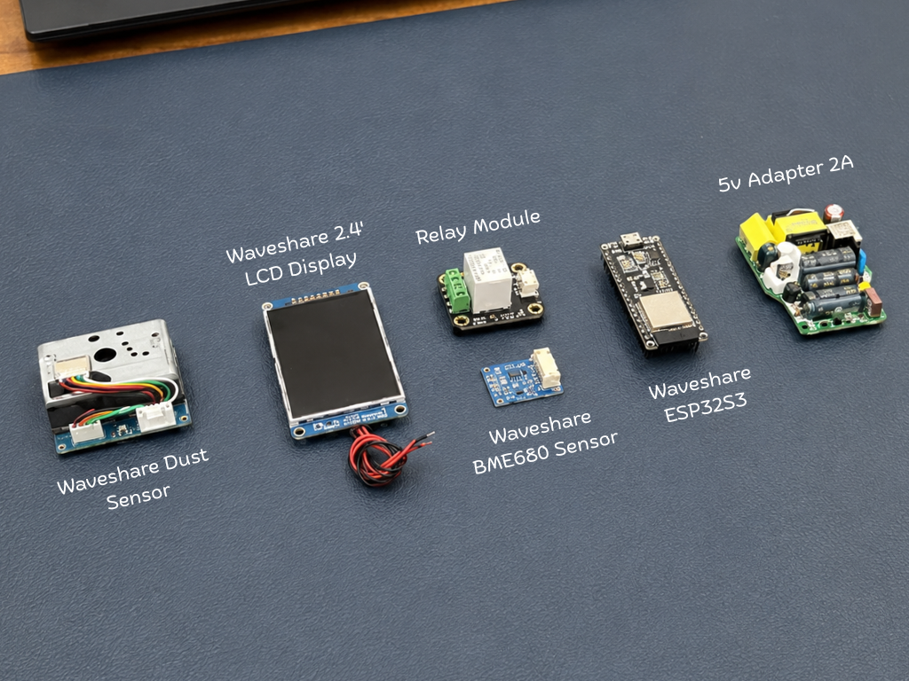
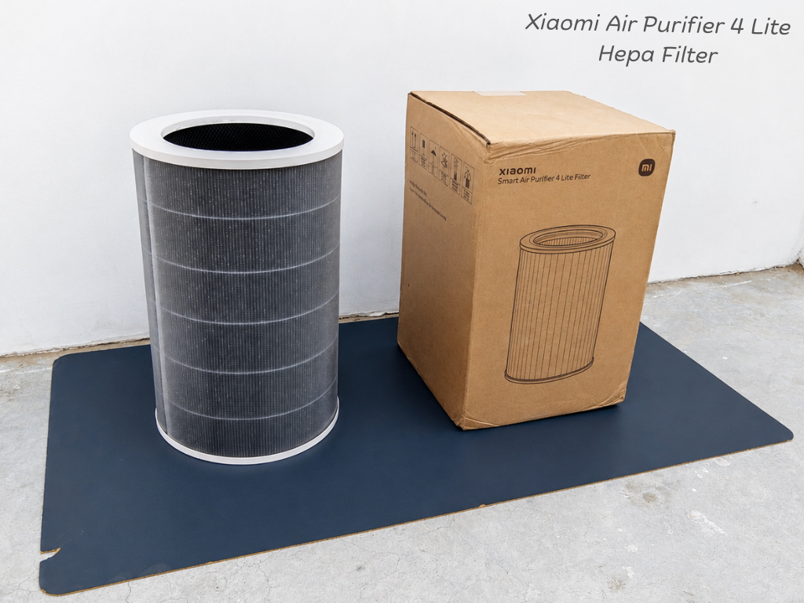
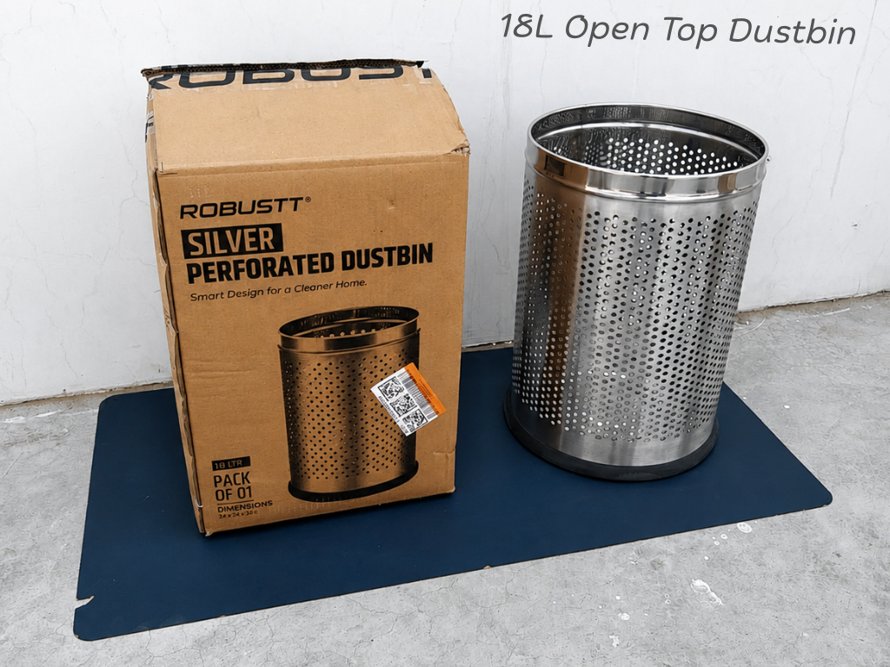
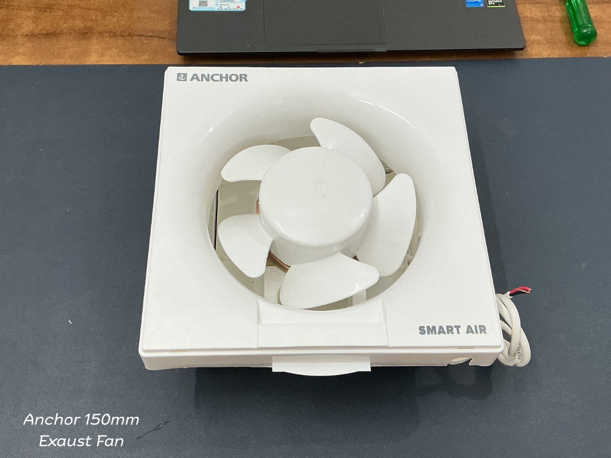
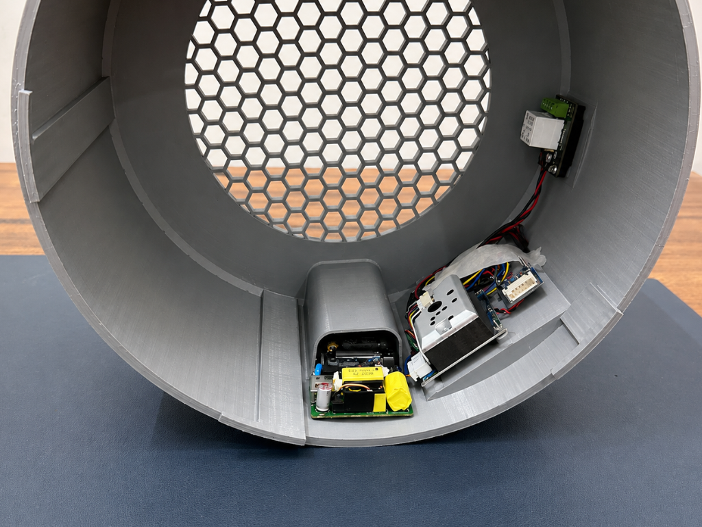

 

  

# Air Sense

**The Smartest DIY Air Purifier — Engineered from Scratch**

 

<!-- ════════ REPO STATS ════════ -->

---
 

## 🌿 Overview

Indoor air pollution is often invisible, yet it can significantly impact our health and comfort. **AirSense** is an open-source smart air purifier that combines real-time environmental monitoring, intelligent purification, and cloud connectivity into a single device.

Powered by the **Waveshare ESP32-S3**, AirSense continuously measures **PM2.5 dust levels, temperature, humidity, atmospheric pressure, and indoor air quality** using dedicated sensors. Live data is displayed on a modern **LVGL-powered TFT dashboard** and synchronized with **Arduino IoT Cloud**, allowing remote monitoring and fan control from anywhere.

Designed in **Autodesk Fusion**, the system features a custom 3D-printed enclosure, HEPA filtration, automatic fan control, and a product-like user experience. This repository includes everything needed to build your own AirSense, including source code, CAD files, circuit diagrams, and setup instructions.
 

---
 

## Live Display

  AirSense Live Dashboard — PM2.5 Dust · AQI · Temperature · Humidity · Air Quality · Feed Rate · Filter Health · Wi-Fi Status

 

---

 

## Demo

  
▶ Click to watch the full build and demo on YouTube

 

---

 

## ✨ Features

**AirSense** combines intelligent air purification, environmental monitoring, and cloud connectivity into a single product-grade device. It continuously monitors **PM2.5 dust levels, AQI, temperature, humidity, atmospheric pressure, and indoor air quality** in real time, presenting all information through a beautiful **LVGL-powered dashboard**. The system uses a **Xiaomi Air Purifier 4 Lite HEPA filter**, capable of capturing up to **99.97% of airborne particles as small as 0.3 μm**, helping create a cleaner and healthier indoor environment.

Built around the **ESP32-S3**, AirSense synchronizes live data with **Arduino IoT Cloud**, enabling remote monitoring and control from anywhere through a smartphone, tablet, or web browser. The custom enclosure, designed in **Autodesk Fusion 360**, delivers a clean product-like appearance while maintaining easy assembly and maintenance. With complete source code, CAD files, circuit diagrams, and documentation included, AirSense is a fully open-source platform designed for learning, customization, and real-world everyday use.
 

---

 

## Enclosure Design

  
Fusion 360 CAD — cylindrical body · hexagonal intake grille · side-mounted TFT cutout · Next Builder branding

 

The enclosure is designed around the **Xiaomi Air Purifier 4 Lite HEPA filter**, creating a compact and efficient airflow path. A **150mm high-airflow fan** is mounted at the top, drawing contaminated air through the filter and exhausting clean air upward. The **2.4-inch TFT display** is seamlessly integrated into a precision-cut side panel for a clean, product-like appearance. An **18L stainless steel dustbin** serves as the main structural body, providing excellent durability, a premium finish, and easy availability for replication.

 

---
 

## Bill of Materials

 
All electronic components

  

<table>
<tr>
<td align="center" width="33%">
  
<b>Xiaomi Air Purifier 4 Lite</b> 
True HEPA Filter — 0.3 µm
</td>
<td align="center" width="33%">
  
<b>18L Open-Top Steel Dustbin</b> 
Structural enclosure body
</td>
<td align="center" width="33%">
  
<b>Anchor 150mm Exhaust Fan</b> 
220V Smart Air — circulation
</td>
</tr>
</table>

 

> Full BOM with purchase links is in the [Instructables tutorial →](https://www.instructables.com/AirSense-the-Smartest-DIY-Air-Purifier/)

 

---

 

## Internal Assembly

  
Inside view after complete wiring and assembly

 

**Wiring Notes**

* The relay switches the **220V AC fan**, so always disconnect mains power before making any wiring changes or performing maintenance.
* The dust sensor relies on a precise LED pulse timing sequence for accurate measurements. The sampling logic used in the firmware should remain unchanged.
* The BME680 communicates via the **I²C interface**, using dedicated SDA and SCL connections on the ESP32-S3.
* The TFT display operates over **SPI**. Ensure all display pins, including CS, DC, and RST, match the assignments defined in the provided `User_Setup.h` file.
* Before powering the system, verify all power, signal, and ground connections to ensure safe and reliable operation.

 

---

 

## How It Works

AirSense continuously monitors the surrounding environment using dedicated air quality and environmental sensors. Every few seconds, the system measures **PM2.5 dust concentration, temperature, humidity, atmospheric pressure, and indoor air quality**, providing a real-time view of indoor environmental conditions.

The collected data is processed by the **ESP32-S3**, which calculates the Air Quality Index (AQI) and updates all measurements on the built-in **LVGL-powered dashboard**. Users can instantly view key air quality metrics through a clean and intuitive graphical interface. At the same time, sensor readings are synchronized with **Arduino IoT Cloud** over Wi-Fi, allowing remote monitoring from anywhere using a smartphone, tablet, or web browser.

The purification fan operates continuously to draw air through the **HEPA filtration system**, where dust and airborne particles are captured before clean air is released back into the environment. Users can manually turn the purifier on or off at any time using the **Arduino IoT Remote App**, providing convenient control from anywhere. By combining real-time monitoring, cloud connectivity, and continuous air purification, AirSense helps users better understand and improve the quality of the air they breathe every day.

 

---

 

## 📚 Build Guide & Documentation

Want to build your own **AirSense**? Complete step-by-step instructions, cloud configuration, wiring details, assembly photos, and testing procedures are available in the full written tutorials below.

Whether you're a beginner exploring IoT and air quality monitoring or an experienced maker looking to customize the design, these guides will walk you through the entire build process from start to finish.

### Tutorials & Project Documentation

* **Instructables**
  https://www.instructables.com/AirSense-the-Smartest-DIY-Air-Purifier/

* **Hackster.io**
  https://www.hackster.io/NEXTBUILDER/airsense-the-smartest-diy-air-purifier-f775f8

* **Hackaday.io**
  https://hackaday.io/project/205928-airsense-the-smartest-diy-air-purifier

* **ElectronicWings**
  https://www.electronicwings.com/users/NextBuilder/projects/6592/airsense---the-smartest-diy-air-purifier

All project resources, including firmware, CAD models, library configuration files, and circuit diagrams, are available in this GitHub repository.

---
 

## License

Open for **personal and educational use only.**
Commercial use, resale, or redistribution in any product requires explicit written permission from the author.

 

---

 

Built with ❤️ by **[Next Builder](https://youtube.com/@next.builder)** ·

*Built one? Share it. Open an issue, tag us, drop a photo — the community makes this worth building.*

 

 

*⭐ Star this repo if it helped you build something awesome ⭐*

